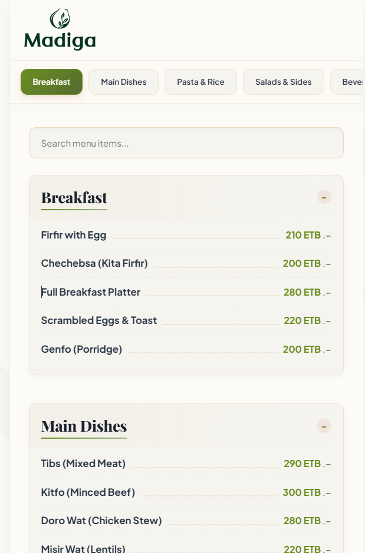
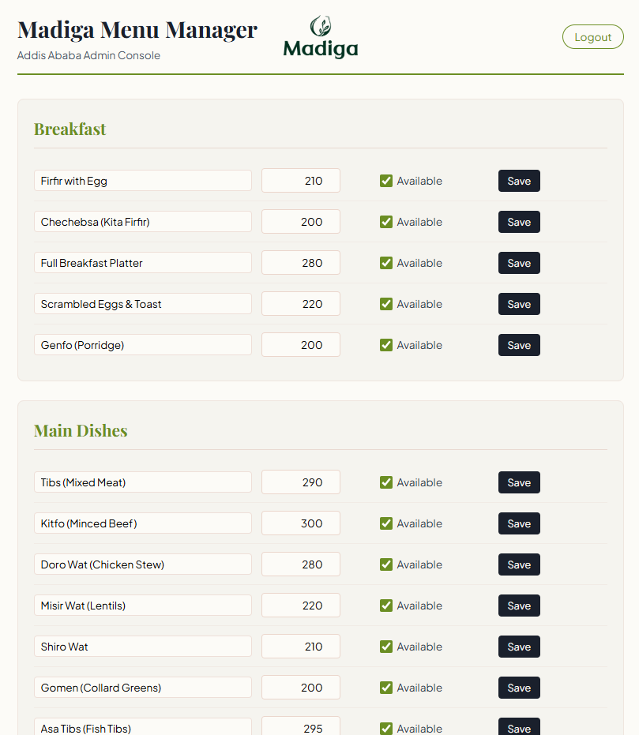

# Madiga Cafe & Restaurant Digital Menu

A premium, modern digital QR restaurant menu and admin control panel designed for **Madiga Cafe & Restaurant** (Addis Ababa, Ethiopia). 

This system allows customers to view the restaurant menu dynamically on any device, and enables the restaurant administrator to manage the menu items (toggle availability and update prices) in real-time.

---

## 📸 Screenshots

### 1. Customer Digital Menu Interface
An elegant, mobile-friendly interactive menu with category navigation, smooth scrolling, and collapsible sections.


### 2. Admin Menu Manager Dashboard
A secure, password-protected dashboard for restaurant managers to quickly toggle item availability (e.g., mark items as "Sold Out") and update pricing.


---

## 🚀 Key Features

*   **Premium Interactive Menu**: Styled with a warm Ethiopian-modernist aesthetic (terracotta gradients, clean Outfit/Playfair typography, and smooth micro-animations).
*   **Real-time Admin Operations**: Instantly update item names, pricing, and availability status without reloading the client interface.
*   **Robust Cloud Database**: Powered by **MongoDB Atlas** for reliable, production-grade cloud storage.
*   **Vercel Serverless Ready**: Fully optimized for deployment on Vercel's serverless functions.
*   **Responsive Layout**: Optimized for all screens, from mobile phones to desktop monitors.

---

## 🛠️ Tech Stack

*   **Frontend**: Plain HTML5, Vanilla CSS3 (Custom Variables), and modern client-side Javascript.
*   **Backend**: Node.js & Express.
*   **Database**: MongoDB Atlas.

---

## ⚙️ Local Setup

1.  **Clone or Open** this workspace directory.
2.  Install dependencies:
    ```bash
    npm install
    ```

3.  Set up your environment variables by creating a `.env` file in the root directory:
    ```env
    MONGODB_URI=your_mongodb_connection_string
    ADMIN_PASSWORD=only admin can access
    ```
4.  Seed the sample database:
    ```bash
    node seed.js
    ```
5.  Start the local server:
    ```bash
    npm start
    ```
6.  Open your browser and navigate to:
    *   **Customer Menu**: `http://localhost:3000`
    *   **Admin Panel**: `http://localhost:3000/admin.html`
